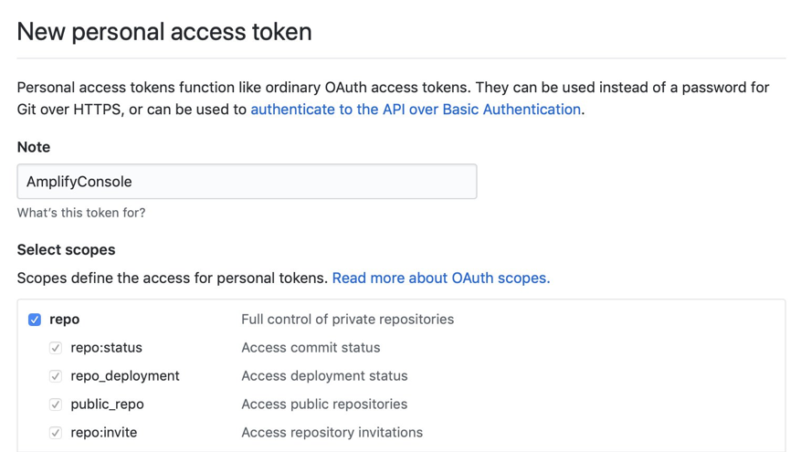

<!-- Copyright 2019 Amazon.com, Inc. or its affiliates. All Rights Reserved.
SPDX-License-Identifier: MIT-0

Permission is hereby granted, free of charge, to any person obtaining a copy of this
software and associated documentation files (the "Software"), to deal in the Software
without restriction, including without limitation the rights to use, copy, modify,
merge, publish, distribute, sublicense, and/or sell copies of the Software, and to
permit persons to whom the Software is furnished to do so.

THE SOFTWARE IS PROVIDED "AS IS", WITHOUT WARRANTY OF ANY KIND, EXPRESS OR IMPLIED,
INCLUDING BUT NOT LIMITED TO THE WARRANTIES OF MERCHANTABILITY, FITNESS FOR A
PARTICULAR PURPOSE AND NONINFRINGEMENT. IN NO EVENT SHALL THE AUTHORS OR COPYRIGHT
HOLDERS BE LIABLE FOR ANY CLAIM, DAMAGES OR OTHER LIABILITY, WHETHER IN AN ACTION
OF CONTRACT, TORT OR OTHERWISE, ARISING FROM, OUT OF OR IN CONNECTION WITH THE
SOFTWARE OR THE USE OR OTHER DEALINGS IN THE SOFTWARE. -->

# Functionless URL Shortener
This app creates a URL shortener without using any compute. All business logic is handled at the Amazon API Gateway level. The basic app will create an API Gateway instance utilizing Cognito for authentication and authorization. It will also create an Amazon DynamoDB table for data storage. It will also create a simple Vuejs application as a demo client.

Read the blog series about this application:
1. [Building a serverless URL shortener app without AWS Lambda – part 1](https://aws.amazon.com/blogs/compute/building-a-serverless-url-shortener-app-without-lambda-part-1)
1. [Building a serverless URL shortener app without AWS Lambda – part 2](https://aws.amazon.com/blogs/compute/building-a-serverless-url-shortener-app-without-lambda-part-2)
1. [Building a serverless URL shortener app without AWS Lambda – part 3](https://aws.amazon.com/blogs/compute/building-a-serverless-url-shortener-app-without-lambda-part-3)

## The Backend

### Services Used
* <a href="https://aws.amazon.com/api-gateway/" target="_blank">Amazon API Gateway</a>
* <a href="https://aws.amazon.com/cognito/" target="_blank">Amazon Cognito</a>
* <a href="https://aws.amazon.com/dynamodb/" target="_bank">Amazon DynamoDB</a>
* <a href="https://aws.amazon.com/amplify/console/" target="_blank">AWS Amplify Console</a>
* <a href="https://aws.amazon.com/cloudfront/" target="_blank">Amazon CloudFront</a> *Will cause a lengthy deployment time. See note under **Deploying**
* <a href="https://aws.amazon.com/s3/" target="_blank">Amazon S3</a>


### Requirements for deployment
* <a href="https://aws.amazon.com/cli/" target="_blank">AWS CLI</a>
* <a href="https://docs.aws.amazon.com/serverless-application-model/latest/developerguide/serverless-sam-cli-install.html" target="_blank">AWS SAM CLI v0.37.0+</a>
* Forked copy of this repository. Instructions for forking a GitHib repository can be found <a href="https://help.github.com/en/github/getting-started-with-github/fork-a-repo" target="_blank">here</a>
* A GitHub personal access token with the *repo* scope as shown below. Instructions for creating a personal access token can be found <a href="https://help.github.com/en/github/authenticating-to-github/creating-a-personal-access-token-for-the-command-line#creating-a-token" target="blank">here</a>

    

    **Be sure and store you new token in a place that you can find it.**

### Deploying

***Note: This stack includes an Amazon CloudFront distribution which can take around 30 minutes to create. Don't be alarmed if the deploy seems to hang for a long time.***
In the terminal, use the SAM CLI guided deployment the first time you deploy
```bash
sam deploy -g
```

#### Choose options
You can choose the default for all options except *GithubRepository* and **

```bash
## The name of the CloudFormation stack
Stack Name [URLShortener]:

## The region you want to deploy in
AWS Region [us-west-2]:

## The name of the application (lowercase no spaces). This must be globally unique
Parameter AppName [shortener]:

## Enables public client and local client for testing. (Less secure)
Parameter UseLocalClient [false]:

## GitHub forked repository URL
Parameter GithubRepository []:

## Github Personal access token
Parameter PersonalAccessToken:

## Shows you resources changes to be deployed and requires a 'Y' to initiate deploy
Confirm changes before deploy [y/N]: 

## SAM needs permission to be able to create roles to connect to the resources in your template
Allow SAM CLI IAM role creation [Y/n]:

## Save your choice for later deployments
Save arguments to samconfig.toml [Y/n]:
```

SAM will then deploy the AWS CloudFormation stack to your AWS account and provide required outputs for the included client.

After the first deploy you may re-deploy using `sam deploy` or redeploy with different options using `sam deploy -g`.

## The Client

*The client can also be run locally for debugging. Instructions can be found [here](./client/README.md).*

The client is a Vue.js application that interfaces with the backend and allows you to authenticate and manage URL links. The client is hosted using Amplify Console. To avoid circular dependencies, we need to provide some information for the client after stack is built. The information needed is provided at the end of the deploy process. If you do not have the information you can run the following:

```bash
aws cloudformation describe-stacks --stack-name URLShortener
```

We need to add this information to the environment variables for the Amplify Console app. There are two options for adding the variables.

#### Option 1: using the AWS CLI (Update the *\<values\>* to reflect the information returned from the deployment.)

```bash
aws amplify update-app --app-id <MyAmplifyAppId> --environment-variables \
VUE_APP_NAME=<VueAppName>\
,VUE_APP_CLIENT_ID=<VUE_APP_CLIENT_ID>\
,VUE_APP_API_ROOT=<VUE_APP_API_ROOT>\
,VUE_APP_AUTH_DOMAIN=<VUE_APP_AUTH_DOMAIN>
```

*Also available in the stack output as **AmplifyEnvironmentUpdateCommand***

#### Option 2: Amplify Console page
1. Open the [Amplify Console page](https://us-west-2.console.aws.amazon.com/amplify/home)
1. On the left side, under **All apps**, choose *Url-Shortner-Client*
1. Under **App settings** choose *Environment variables*
1. Choose the *manage variables* button
1. Choose *add variable*
1. Fill in the *variable* and it's corresponding *Value*
1. Leave defaults for *Branches* and *Actions*
1. Repeat for all four variables
1. Choose save

### Starting the first deployment
After deploying the CloudFormation template, you need to go into the Amplify Console and trigger a build. The CloudFormation template can provision the resources, but can’t trigger a build since it creates resources but cannot trigger actions. This can be done via the AWS CLI.

#### Option 1: Using the AWS CLI (Update the *\<values\>* to reflect the information returned from the deployment.)

```bash
aws amplify start-job --app-id <MyAmplifyAppId> --branch-name master --job-type RELEASE
```
*Also available in the stack output as **AmplifyDeployCommand***

To check on the status, you can view it on the AWS Amplify Console or run:
```bash
aws amplify get-job --app-id <MyAmplifyAppId> --branch-name master --job-id <JobId>
```

#### Option 2: Amplify Console page
1. Open the <a href="https://us-west-2.console.aws.amazon.com/amplify/home" target="_blank">Amplify Console page</a>
1. On the left side, under **All apps**, choose *Url-Shortner-Client*
1. Click *Run build*

*Note: this is only required for the first build subsequent client builds will be triggered when updates are committed to your forked repository.

## Cleanup
1. Open the <a href="https://us-west-2.console.aws.amazon.com/cloudformation/home" target="_blank">CloudFormation console</a>
1. Locate a stack named *URLShortener*
1. Select the radio option next to it
1. Select **Delete**
1. Select **Delete stack** to confirm

*Note: If you opted to have access logs (on by default), you may have to delete the S3 bucket manually.
